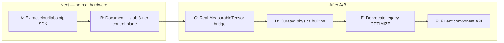

# Future steps — after authoring loop (mock complete)

**Status:** backlog / sequencing (not an active sprint plan)  
**Last updated:** 2026-07-12  
**Context:** Mock-first authoring is closed (`connect` / `prepare` / `run_optimize` / session kernels).  
**Hard gate:** do **not** deepen `lab_communicator/real` or `lab_automation` until **Step A** and preferably **Step B** below are done.

**Related:** [`PROGRAMMABLE_LAB_VISION.md`](./PROGRAMMABLE_LAB_VISION.md), [`EXECUTION_MODES.md`](./EXECUTION_MODES.md), [`SESSION_KERNELS.md`](./SESSION_KERNELS.md), [`REAL_BENCH_ROADMAP.md`](./REAL_BENCH_ROADMAP.md) (hardware TeleOp — later).

---

## Why this order

Today the **laptop that writes scripts**, the **FastAPI process**, and the **mock “edge”** are usually the same checkout / same machine. That is fine for prototyping and wrong as a product story:

| Role | Who | Should need |
|------|-----|-------------|
| **Author** | Experimentalist | `pip install cloudlabs` + URL + credentials |
| **Operator / platform** | Lab IT / maintainers | Server + catalog + leases + jobs |
| **Bench owner** | Person with USB/Ethernet to hardware | Edge agent + drivers (`lab_automation`) |

Closed-loop already assumes **edge-owned** eval loops ([`EXECUTION_MODES.md`](./EXECUTION_MODES.md)). Distribution makes that physical, not just logical.



---

## Step A — Extract a standalone `cloudlabs` SDK package *(next priority)*

**Goal:** Authors never clone this monorepo just to call `connect()`.

**Do:**

1. Carve current `backend/lab_model/optimization/sdk/` into a distributable package (keep monorepo for now), e.g. `packages/cloudlabs/` or `cloudlabs-sdk/` with its own `pyproject.toml`.
2. Public import: `import cloudlabs` / `from cloudlabs import connect` (thin re-export or rename).
3. Minimal deps: `requests`/`httpx`, typing; optional extras e.g. `cloudlabs[kernels]` for TorchScript compile-on-laptop.
4. Editable install: `pip install -e ./packages/cloudlabs`.
5. Point examples + [`Run_CloudLab_Scripts.md`](./Run_CloudLab_Scripts.md) at the package; keep server importing the same code or a thin shim during transition.
6. **Do not** invent fluent `lab.components.tag_20...` in this step (that is Step F).

**Exit:** A notebook **outside** this repo can `pip install -e …` and run `connect(base_url=...)` against a running mock server.

**Non-goals:** PyPI publish (optional later); rewriting FastAPI; real hardware.

---

## Step B — Three-tier topology (control plane vs edge) — still mock-first

**Goal:** Stop assuming “server process == edge process.” Matchmaker stays central; fast loops stay on the edge.

### Target physical split

| Tier | Machine | Runs |
|------|---------|------|
| **1. Client** | Author laptop | Browser UI and/or `cloudlabs` SDK |
| **2. Coordinator** | Always-on host (lab VM / cloud) | FastAPI surfaces, leases, job queue, catalog, wiki |
| **3. Edge agent** | Bench PC (or mock agent on a second process) | Communicator + closed-loop kernels + drivers |

### Latency policy (normative)

| Mode | Path | Latency expectation |
|------|------|---------------------|
| **Imperative** | Client → coordinator → edge | Tens–hundreds of ms; OK for notebooks |
| **Compiled DAG** | Package once → edge executes | Client not in the inner loop |
| **Closed-loop** | Package + kernels once → **edge-local** loop | Camera/motor stay local; progress/telemetry up |

### Design choices (locked for v1 of distribution)

1. **Coordinator remains the control plane** for lease, auth, and job submit. Do **not** build client↔edge peer tunnels yet (NAT/auth complexity); revisit only if imperative RTT becomes a measured problem.
2. **Edge connects outbound** to the coordinator (“I am `mock.default` / `real.bench_1`, send work”) — firewall-friendly.
3. Session kernel packages and objective IR travel **with the job** to the edge (already the mock pattern via `kernel_packages`).
4. Mock can validate the split by running **coordinator + edge agent as two processes** on one machine before any real bench.

**Exit:** Job submit + lease + closed-loop work when communicator is a **separate edge process** speaking the same HTTP/WS contract; UI and SDK unchanged in spirit.

**Hard gate reminder:** Step B may use a **mock** edge agent. Real/`lab_automation` waits for Step C.

---

## Step C — Real data-plane bridge (Horizon 2)

**Only after A (+ preferably B).**

- Materialize real camera frames into `MeasurableTensor` with the same layout mock kernels already consume (BGR/bytes → NCHW float for TorchScript).
- Wire session + catalog kernels on real ensemble eval without synthetic fallback for torchscript terms.
- See also older TeleOp-oriented notes in [`REAL_BENCH_ROADMAP.md`](./REAL_BENCH_ROADMAP.md) — reconcile; do not fork two “real” stories.

**Exit:** One real camera frame → one session/catalog kernel scalar/features on the edge, observable in job telemetry.

---

## Step D — Curated physics kernel library (Horizon 3)

**After C** (so fits are validated on real beams, not only mock noise).

Candidates (TorchScript / allowlisted builtins):

- `builtin.gaussian_beam_fit` → `[amplitude, cx, cy, sigma_x, sigma_y]` (or features kind)
- `builtin.roi_centroid` — sub-pixel CoM in a bbox
- Scope/array kernels (e.g. bandpass) only when non-image measurables share the same tensor pipeline

Authors keep writing custom `session.*` modules; builtins are the high-value defaults.

---

## Step E — Unify / deprecate legacy OPTIMIZE (Horizon 1)

**After C** (and ideally D for UI parity).

- Route new UI/scripts through ensemble IR + `run_optimize`.
- Treat single-knob tunes as one-variable / one-term ensemble jobs.
- Deprecate standalone Newton/legacy loops once Operators and Twin flows have parity (telemetry, cancel, kernels).

**Do not** rip out legacy paths before real closed-loop telemetry matches what operators trust today.

---

## Step F — Fluent component API (Horizon 4)

**Last among these.** Ergonomics only; helpers already unblock science scripts.

```python
# Target shape (illustrative — not implemented)
lab.components.tag_20.move(x=12.5)
# or catalog-driven attributes — exact surface TBD
```

Depends on stable capability catalog from the coordinator; natural follow-on once the pip SDK (Step A) is the only author surface.

---

## Explicit non-goals until gated

| Item | Wait until |
|------|------------|
| Deep `RealLabCommunicator` / `lab_automation` work | Step A done; Step B preferred |
| Production-open session kernel registration on real benches | Trust model + Step C |
| Promote `session.*` → catalog pin UI | Policy UX after authors use Step A package |
| Client↔edge direct (bypass coordinator) after pairing | Proven need post Step B |
| PyPI release of `cloudlabs` | Local editable install works (Step A exit) |

---

## One-line summary

**Next:** ship `cloudlabs` as a pip package so authors are not server operators.  
**Then:** split coordinator vs edge (mock agent first).  
**Only then:** real tensors, curated physics kernels, kill legacy OPTIMIZE, fluent API.
