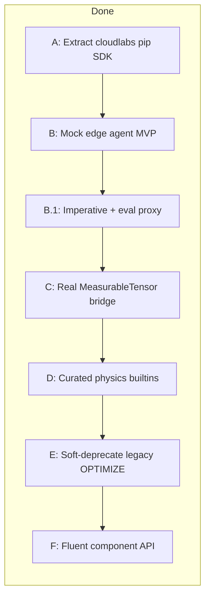

# Future steps — after authoring loop (mock complete)

**Status:** backlog / sequencing (not an active sprint plan)  
**Last updated:** 2026-07-12  
**Context:** Mock-first authoring is closed (`connect` / `prepare` / `run_optimize` / session kernels).  
**Hard gate:** do **not** deepen TeleOp / ComponentRegistry / full `lab_automation` ownership until Steps A–C are done (shipped on mock + capture bridge). Step D+ may use real beams; invasive hardware work stays gated by [`REAL_BENCH_ROADMAP.md`](./REAL_BENCH_ROADMAP.md).

**Related:** [`PROGRAMMABLE_LAB_VISION.md`](./PROGRAMMABLE_LAB_VISION.md), [`EXECUTION_MODES.md`](./EXECUTION_MODES.md), [`SESSION_KERNELS.md`](./SESSION_KERNELS.md), [`REAL_BENCH_ROADMAP.md`](./REAL_BENCH_ROADMAP.md) (hardware TeleOp — later).

---

## Why this order

Today the **laptop that writes scripts**, the **FastAPI process**, and the **mock “edge”** are usually the same checkout / same machine. That is fine for prototyping and wrong as a product story:

| Role | Who | Should need |
|------|-----|-------------|
| **Author** | Experimentalist | `pip install cloudlabs` + URL + credentials |
| **Operator / platform** | Lab IT / maintainers | Server + catalog + leases + jobs |
| **Bench owner** | Person with USB/Ethernet to hardware | Edge agent + drivers (`lab_automation`) |

Closed-loop already assumes **edge-owned** eval loops ([`EXECUTION_MODES.md`](./EXECUTION_MODES.md)). Distribution makes that physical, not just logical.



---

## Step A — Extract a standalone `cloudlabs` SDK package *(done on develop/caio-distributed)*

**Goal:** Authors never clone this monorepo just to call `connect()`.

**Done:**

1. Package at [`packages/cloudlabs/`](../packages/cloudlabs/) with `src/cloudlabs/` + `pyproject.toml`
2. Public import: `from cloudlabs import connect`
3. Deps: `requests`, `pydantic`; extras `kernels`, `images`
4. Editable install: `pip install -e ./packages/cloudlabs`
5. Examples + [`Run_CloudLab_Scripts.md`](./Run_CloudLab_Scripts.md) use the package; `lab_model.optimization.sdk` is a re-export shim
6. Catalog + session `eval_kernel` via edge `POST /api/kernels/eval` (no monorepo TorchScript on the laptop)

**Exit:** A notebook outside this repo can `pip install -e …` and run `connect(base_url=...)` against a running mock server.

**Non-goals (still):** PyPI publish; Step B edge process split; real hardware.

---

## Step B — Three-tier topology (control plane vs edge) — **MVP shipped (mock)**

**Goal:** Stop assuming “server process == edge process.” Matchmaker stays central; fast loops stay on the edge.

### Target physical split

| Tier | Machine | Runs |
|------|---------|------|
| **1. Client** | Author laptop | Browser UI and/or `cloudlabs` SDK |
| **2. Coordinator** | Always-on host (lab VM / cloud) | FastAPI surfaces, leases, job queue, catalog, wiki |
| **3. Edge agent** | Bench PC (or mock agent on a second process) | Communicator + closed-loop kernels + drivers |

### Latency policy (normative)

| Mode | Path | Latency expectation |
|------|------|---------------------|
| **Imperative** | Client → coordinator → edge | Tens–hundreds of ms; OK for notebooks |
| **Compiled DAG** | Package once → edge executes | Client not in the inner loop |
| **Closed-loop** | Package + kernels once → **edge-local** loop | Camera/motor stay local; progress/telemetry up |

### Design choices (locked for v1 of distribution)

1. **Coordinator remains the control plane** for lease, auth, and job submit. Do **not** build client↔edge peer tunnels yet (NAT/auth complexity); revisit only if imperative RTT becomes a measured problem.
2. **Edge connects outbound** to the coordinator (“I am `mock.default` / `real.bench_1`, send work”) — firewall-friendly.
3. Session kernel packages and objective IR travel **with the job** to the edge (already the mock pattern via `kernel_packages`).
4. Mock can validate the split by running **coordinator + edge agent as two processes** on one machine before any real bench.

### MVP shipped (2026-07-12)

| Piece | Location |
|-------|----------|
| Edge registry | [`backend/lab_model/edge/`](../backend/lab_model/edge/) |
| APIs | `POST /api/edge/register`, `/heartbeat`, `/unregister`; `GET /api/edge/work`; `POST /api/edge/jobs/{id}/progress\|complete` |
| Dispatch gate | `_kick_job_runner_for` skips in-process runner when edge attached |
| Mock agent | [`scripts/ops/mock_edge_agent.py`](../scripts/ops/mock_edge_agent.py) — closed_loop + compiled_dag + command poll |

**Runbook (two terminals):**

```powershell
# T1 — coordinator
$env:PYTHONPATH="backend"; python backend/main.py

# T2 — edge (start BEFORE submitting jobs)
python scripts/ops/mock_edge_agent.py --base-url http://127.0.0.1:8000

# T3 — client
pip install -e ./packages/cloudlabs
python scripts/language/03_closed_loop_catalog.py
```

`GET /api/backends` shows `edge_attached: true` while the agent heartbeats.

**Still deferred after Step B MVP:** see **Step B.1** below (imperative proxy shipped there).

**Exit (MVP):** Job submit + lease + closed-loop complete with communicator in a **separate** mock edge process; SDK unchanged.

**Hard gate reminder:** Real/`lab_automation` waits for Step C.

---

## Step B.1 — Deepen mock edge (imperative + eval + compiled_dag) — **shipped**

**Goal:** End the split-brain where closed-loop runs on the edge but `/api/command` and `/api/kernels/eval` still hit the coordinator’s in-process lab.

### Shipped

| Piece | Behavior |
|-------|----------|
| Edge command queue | [`backend/lab_model/edge/commands.py`](../backend/lab_model/edge/commands.py) |
| APIs | `GET /api/edge/commands`, `POST /api/edge/commands/{id}/complete` |
| Proxy | When `edge_attached`, `/api/command` and `/api/kernels/eval` enqueue and wait |
| Mock agent | Polls commands first, then jobs; runs `closed_loop` + `compiled_dag` |

**Still deferred after B.1:** TeleOp WS through coordinator; client↔edge peer tunnels; production session-kernel policy.

**Ops hardening:** edge lab-state SoT (heartbeat cache / `get_lab_state` proxy); **5s** stale eviction fail-closes jobs+leases; Operations shows `edge_offline`; mock heartbeat default **1.5s** with `lab_state` push.

**Exit:** With edge attached, imperative move / `eval_kernel` / closed-loop all touch the **edge** communicator.

---

## Step C — Real data-plane bridge (Horizon 2) — **shipped (MVP)**

**Goal:** One camera frame on the edge → same BGR layout kernels already consume → TorchScript scalar/features, **without** inventing synthetic frames on real backends.

### Shipped

| Piece | Behavior |
|-------|----------|
| Shared capture→BGR | [`read_camera_bgr_for_tag`](../backend/lab_model/measurables/capture.py) + `LabCommunicator.read_camera_bgr` |
| MeasurableTensor resolve | Camera images materialize as **BGR uint8 HWC** (`axes.c = "bgr"`), matching manifest `bgr_hwc_uint8` |
| Kernel eval | `POST /api/kernels/eval` uses `read_camera_bgr`; **real** returns 503 on capture failure; **mock** keeps gray fallback for CI |
| Real ensemble | `RealEnsembleHardwareBridge.capture_bgr_for_tag` uses the shared helper (already fed TorchScript via `collect_objective_measurements`) |
| Tests | [`test_step_c_camera_bridge.py`](../backend/tests/test_step_c_camera_bridge.py) |

**Still deferred:** deep `lab_automation` / TeleOp WS; mock ensemble landscape still uses synthetic BGR for TorchScript terms (intentional for CI without a connected mock cam).

**Exit:** Captured PNG → BGR → `demo.image_mean_score` (or session kernel) on real/edge path; no gray `np.full` on real mode.

---

## Step D — Curated physics kernel library (Horizon 3) — **shipped (MVP)**

**Goal:** High-value catalog feature kernels authors can use without writing `session.*` modules.

### Shipped

| Id | Output | Notes |
|----|--------|-------|
| `builtin.roi_centroid` | `[cx, cy]` | Sub-pixel CoM in center-half ROI (full-frame px) |
| `builtin.gaussian_beam_fit` | `[amplitude, cx, cy, sigma_x, sigma_y]` | Intensity-weighted moments (not NLLS) |

| Piece | Location |
|-------|----------|
| Build | [`scripts/ops/build_torchscript_kernels.py`](../scripts/ops/build_torchscript_kernels.py) |
| Manifest + `.pt` | [`schemas/kernels/`](../schemas/kernels/) |
| SDK | `lab.kernel_match(..., target=(x,y))` → `rms_distance` on feature pair |
| Example | [`scripts/language/02_kernels_and_match.py`](../scripts/language/02_kernels_and_match.py) |

**Still deferred:** parameterized bbox in catalog schema; scope/array (non-image) kernels; nonlinear least-squares Gaussian fit.

**Exit:** Catalog lists both builtins; synthetic spot recovers known centroid; SDK can optimize toward `target_px` via `builtin.roi_centroid`.

---

## Step E — Unify / deprecate legacy OPTIMIZE — **shipped (soft deprecate)**

**Goal:** Route new work through ensemble IR + jobs; keep real-bench NEWTON/COBYLA until visual telemetry parity.

### Shipped

| Piece | Behavior |
|-------|----------|
| Deprecation warning | `run_optimize_component` logs + `DeprecationWarning` on legacy path |
| Optional redirect | `CLOUDLABS_LEGACY_OPTIMIZE_REDIRECT=1` compiles legacy → ensemble via `compile_legacy_strategy` (**mock only**; never on REAL) |
| Capabilities API | `GET /api/optimization/capabilities` |
| Job errors | Closed-loop reject message points authors to ensemble / SDK |
| Schema / strategies | `OptimizeParameters` + `schemas/strategies.json` marked deprecated; BAYESIAN flagged unimplemented |
| Twin UI | Component OPTIMIZE panel + console help show deprecation; strategies labeled legacy |
| Docs | README + ENSEMBLE_OPTIMIZATION migration note |

**Not deleted:** real `primitive_optimize_component`, MJPEG optimization stream, Newton place-UI hook, Twin/console legacy buttons.

**Exit:** New scripts/UI docs prefer ensemble; legacy still runs when operators need it; mock can opt into redirect.

---

## Step F — Fluent component API (Horizon 4) — **shipped (MVP)**

**Goal:** Ergonomic authoring without new HTTP primitives.

```python
lab.components.tag_20.move(x=12.5).wait_until_idle()
lab.components.tag_20.motor(1, 0.5)
lab.components["tag_22"].eval_kernel("camera_image", kernel_id="builtin.roi_centroid")
```

### Shipped

| Piece | Location |
|-------|----------|
| Proxies | [`packages/cloudlabs/src/cloudlabs/components.py`](../packages/cloudlabs/src/cloudlabs/components.py) |
| Client | `lab.components` property |
| Example | [`scripts/language/01_hello_lab.py`](../scripts/language/01_hello_lab.py) |
| Tests | [`backend/tests/test_sdk_components.py`](../backend/tests/test_sdk_components.py) |

**Still deferred:** catalog-driven magic attributes per tunable; codegen from capability catalog.

**Exit:** Authors can write fluent scripts that call the same move/eval/optimize paths as before.

---

## Explicit non-goals until gated

| Item | Wait until |
|------|------------|
| Deep `RealLabCommunicator` / `lab_automation` work | Step A done; Step B preferred |
| Production-open session kernel registration on real benches | Trust model + Step C |
| Promote `session.*` → catalog pin UI | Policy UX after authors use Step A package |
| Client↔edge direct (bypass coordinator) after pairing | Proven need post Step B |
| PyPI release of `cloudlabs` | Local editable install works (Step A exit) |
| **Loss kernels** (`torchscript_loss` / `output_kind=loss`) | Design locked in [`LOSS_KERNELS.md`](./LOSS_KERNELS.md); implement when custom losses outgrow metric ids |

---

## One-line summary

**Done (A→F):** standalone `cloudlabs` SDK, mock edge + command proxy, camera→BGR bridge, physics builtins, soft-deprecated legacy OPTIMIZE, fluent `lab.components`.  
**Later:** PyPI publish; TeleOp WS through coordinator; deeper real/`lab_automation` when operators need it ([`REAL_BENCH_ROADMAP.md`](./REAL_BENCH_ROADMAP.md)).
