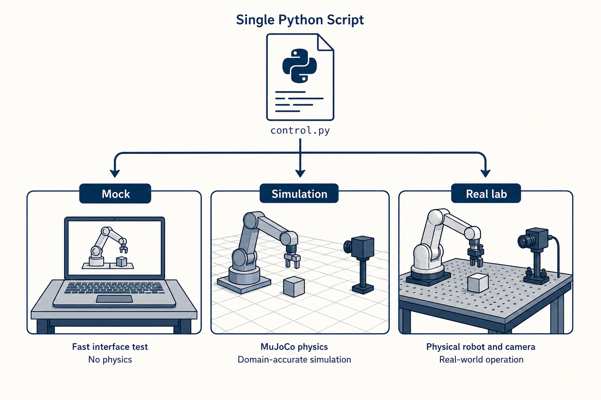
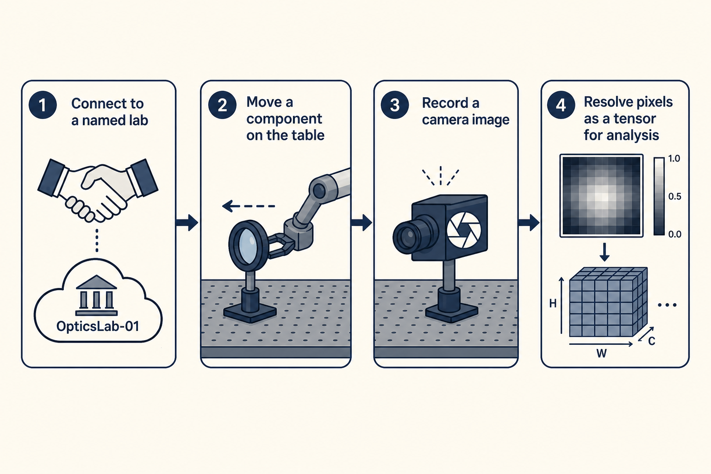
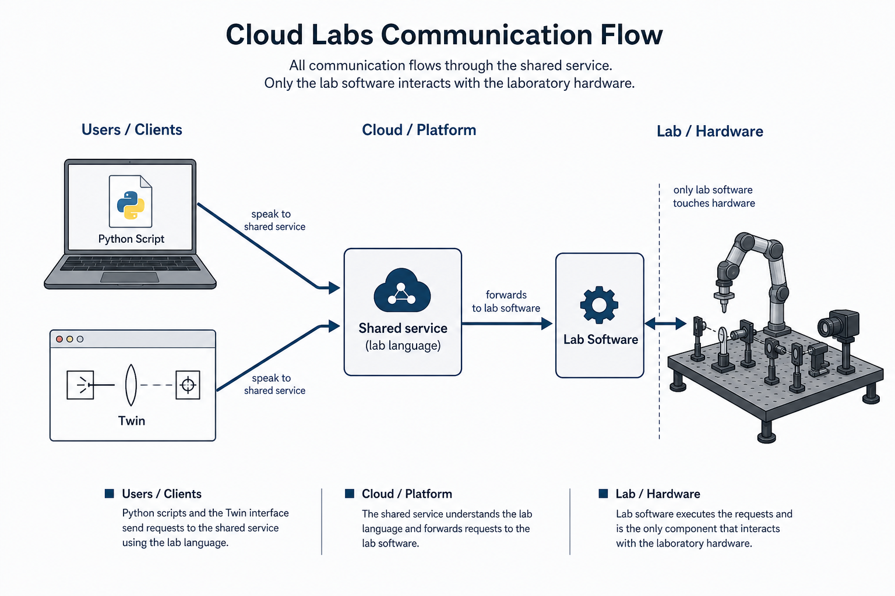
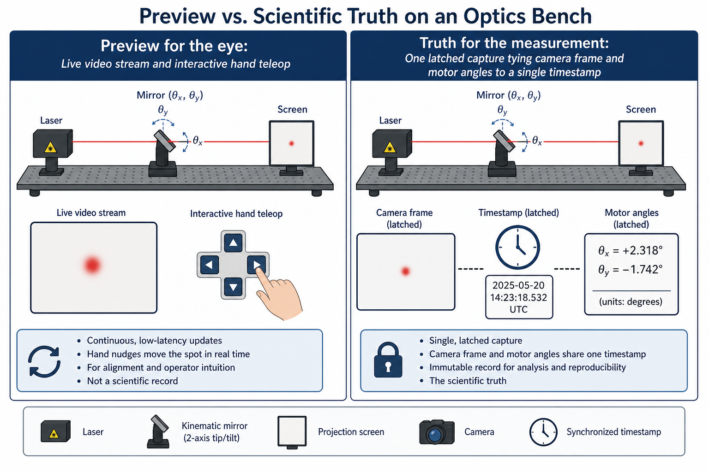
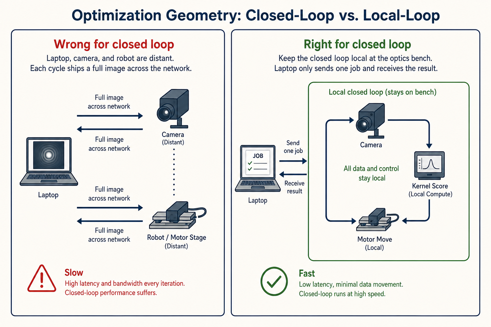

# Cloud Labs

*An onboarding for scientists who run optics experiments.*

---

This document is for someone who already knows how to work on an optics bench and has never heard of Cloud Labs. It explains what the system is for, walks through a short experiment, names the ideas that experiment uses, describes who is involved when a script runs, and then shows how to score images and close an optimization loop on the bench. Technical detail about wiring a new bench appears near the end; folder names appear only in a short appendix.

## What Cloud Labs Is For

Cloud Labs lets you drive a physical optics bench — a robot arm, an industrial camera, a laser, steppers, and components on a breadboard — the same way you would drive a simulation: by writing a short script, or working in a browser, that says move this component, take a picture, score the picture, and optimize until the score is maximized. The central promise is that there is one vocabulary for everything you can do or observe, and that vocabulary is the same whether you are talking to a fast mock on a laptop, a physics simulation, or the real laser bench in the building.



*Figure 1. One experiment script addresses three kinds of bench. The language does not change; only which instrument answers.*

That promise matters because most of experimental work is iteration. You want to debug the logic of a scan on a laptop, rehearse the physics in simulation, and then run the same sequence on hardware without rewriting the science each time.

## A First Experiment

The shortest useful path through Cloud Labs has four steps: connect to a named lab, move a component, record a camera image, and bring the pixels onto your machine as numbers you can plot or feed into analysis.



*Figure 2. A minimal experiment: open a session, command the table, capture an image, and materialize the pixels as a tensor.*

In Python that looks like the following. The named lab `"mock.default"` is a safe place to learn; `"real.default"` is the physical bench when it is registered and running.

```python
from cloudlabs import connect

lab = connect("mock.default")

lab.move_component("tag_22", "tunables.nominal_pose.x", 120.0)

# record=True asks the lab for a fresh capture, then brings the pixels here
image = lab.measurable("tag_22", "camera_image").resolve_torch(record=True)
# image is a torch.Tensor, HxWx3, uint8 BGR (values 0..255)
# use .resolve(record=True) for a NumPy array instead
```

Nothing in that script mentions robots, camera drivers, or network paths. You choose a lab by name, speak in table coordinates and component tags, and ask for measurements when you need them. The rest of this document is an explanation of what those few lines are really doing.

## The Vocabulary That Experiment Used

The script above already used the whole vocabulary, even if the words were not yet named.

The verbs of the system are called **primitives**: the only operations that change or observe the world. Moving a component and recording measurables are primitives. There is deliberately no private side door such as `get_video_feed()` outside that vocabulary, because a lab-specific shortcut would break the promise that mock, simulation, and real speak the same language.

Against those verbs stand a few kinds of nouns. Each named part on the table is a **component** with three bags that must not be mixed.

**Parameters** are static identity: what the part *is*. Type, size, optical density, camera resolution, hardware binding to a recorder port, and similar constants live in the component library under `parameters`. They do not change because you jogged a motor or took a picture; they change when the part definition or wiring changes. Read them with `GET_PARAMETERS` (in the SDK, `lab.components.tag_22.parameters()`).

**Tunables** are the commanded degrees of freedom — a component's nominal pose, a camera exposure, a laser power, a motor angle. In the script, `tunables.nominal_pose.x` is a tunable: you set it, and the bench tries to make it true. When the lab rescans a pose or reads a motor tracker, it **recalculates that same tunable**; that refresh is not a measurable and not a second “reported” field.

**Measurables** are observations with no commanded counterpart. A camera image is a measurable: you do not set the pixels; you capture them. That distinction is easy to miss and important for optics. A pose is still a tunable even when you read it back after a scan, because it has a setpoint; a camera frame is a measurable because it does not.

**Telemetry channels** are the live feeds the catalog declares — a video stream, a teleop pose stream — and you may open them only after running the primitive that arms them. **Kernels** are small compiled scoring functions, usually TorchScript, that turn a camera frame into a number or a few features; they are the subject of a later section, because they are what make closed-loop optimization practical.

The governing rule is simple: if you want something to happen, it must be nameable in this vocabulary. That is what keeps a script portable across benches.

## Who Is Involved When That Script Runs

When you call `connect`, you are not talking to the robot directly. You are talking to a **shared service** that understands the lab language: it checks that your verbs are valid, holds a session so two people do not fight over the same arm, remembers which named lab you asked for, and forwards each command to the software that actually sits next to that bench. Your Python script and the browser interface called the **Twin** are two ways of speaking the same language to that service. The Twin is not a second, more powerful API; it is the same vocabulary with a visual shell.



*Figure 3. You never address the robot from the script. The shared service understands the language; lab software next to the bench turns verbs into motion and captures.*

Beside the physical table runs **lab software** that belongs to the people who own that instrument. It receives the same verbs the mock and the simulation receive, and it alone may touch the arm, the camera, and the steppers. It owns the messy details — coordinate frames on that table, camera protocols, motion planning — so that none of those details leak into your script. From the scientist's point of view the important boundary is this: your notebook stays in the universal language; the lab keeps its hardware knowledge at the bench.

## Preview for the Eye, Truth for the Measurement

Not every interaction with a bench has the same purpose, and Cloud Labs does not pretend one mechanism fits all of them.



*Figure 4. Live video and hand teleop are for alignment and intuition. A latched capture ties image and motor angles to one timestamp and is what you use for analysis.*

Interactive control — hunting a laser spot by nudging a component — needs a continuous, low-latency conversation, so teleoperation lives on a live channel after you start a teleop session. Watching the table needs a video stream, not a thousand separate captures, so live feed is likewise a channel you arm and then watch. Deliberate science — one measurement, one score, one optimization step — uses ordinary commands that return when they finish, or a longer job when an optimizer must run for many seconds next to the camera.

The subtler issue is not speed but correspondence. An industrial camera's shutter and readout can lag encoders by tens of milliseconds, and a remote browser always adds delay. Cloud Labs therefore does not claim that "whatever you see on the live stream right now" is a scientific record. When you ask for a latched measurement, the capture carries a single time stamp for the fields taken together, with an honest note about how that time was obtained. The practical discipline for an experimentalist is straightforward: compose science from latched records, not from two independent live polls. The live streams are for the human eye; the latched observe is for the truth.

## Scoring and Closed-Loop Optimization

Moving and photographing are only half of experimental work. The other half is deciding what “good” looks like on the camera and searching for settings that make the bench better. In Cloud Labs that decision is expressed as a **kernel**: a small TorchScript function that takes an image and returns a scalar score or a short feature vector. Catalog kernels such as `demo.roi_mean_score` and `builtin.roi_centroid` ship with the system; for your own science you register a **session kernel** for the current lease — the same idea as those builtins, authored as a few lines of PyTorch and uploaded once so every later probe and optimization uses that exact artifact on the bench.

The reason the score must run next to the camera becomes obvious as soon as the loop is fast. If each trial shipped a full frame to your laptop for SciPy to score, the network would dominate the experiment. Instead you submit an optimization job: the lab captures, scores with your kernel, and actuates locally, while your script only waits for the result.



*Figure 5. Shipping every frame to a laptop is the wrong geometry for a closed loop. Capture, kernel, and actuate stay on the bench; only the job request and the result cross the network.*

Here is a complete, minimal example that uses a session kernel in the same spirit as the catalog ROI-mean builtin: the mean intensity of the center half of the frame. You register it, probe once to learn the present score \(M_0\), then ask the lab to hold that score while a motor is allowed to move within bounds.

```python
import torch
import torch.nn as nn
from cloudlabs import connect

class CenterRoiMean(nn.Module):
    """Scalar score: mean intensity of the center half of the frame."""

    def forward(self, image: torch.Tensor) -> torch.Tensor:
        if image.dim() == 3:
            image = image.unsqueeze(0)
        _n, _c, h, w = image.shape
        y0, y1 = h // 4, (3 * h) // 4
        x0, x1 = w // 4, (3 * w) // 4
        return image[:, :, y0:y1, x0:x1].mean()

lab = connect("mock.default")

# Upload the kernel for this session (not a lab verb — an artifact)
kernel_id = lab.register_kernel(
    "center_roi_mean",
    module=CenterRoiMean(),
    output_kind="scalar",
    description="Center-ROI mean intensity (session copy of the ROI-mean idea)",
)

# One latched score on the bench — authoring measurement
m0 = lab.probe_kernel("tag_22", "camera_image", kernel_id=kernel_id)
print(f"M0 = {float(m0):.6f}")

# Closed loop: edge runs capture → kernel → move; you wait for the job
result = lab.run_cobyla(
    variables=[
        lab.variable(
            "tag_20",
            "tunables.nominal_motor_positions.1",
            bounds=(-2.0, 2.0),
            delta=True,
        )
    ],
    match_kernel=lab.kernel_match(
        "tag_22",
        "camera_image",
        kernel_id=kernel_id,
        target=float(m0),
    ),
    max_evals=25,
)
print(result.get("status"))
```

A few consequences follow from this shape. `probe_kernel` is still one primitive round-trip: useful when you are authoring, plotting, or deciding a target by hand. `run_cobyla` (and the more general `run_optimize`) is a job: your laptop does not receive a Python callback on every evaluation, so the target — here \(M_0\) — must be baked into the job before you submit. Catalog kernels such as `builtin.roi_centroid` can be used the same way without registering anything; session kernels are how you bring *your* score onto the same path. On mock backends session registration is always allowed; on a physical bench it may need to be enabled by the people who operate that instrument.

## Choosing a Lab by Name

The string you pass to `connect` — `"mock.default"`, `"sim.default"`, `"real.default"`, or another registered name — is the only handle a scientist normally needs. That name selects which instrument the shared service will talk to. Mock is for learning the interface without physics; simulation is for rehearsing dynamics; real is the physical bench when it is online.

If you are only running experiments, you now have the full path: install the `cloudlabs` package, point it at the shared service, connect to the name you were given, and use move, resolve, probe, and optimize as above. The next section is for people who must stand up or maintain a bench; everyone else may skip to the status at the end.

## If You Own or Wire a Bench

Standing up a new instrument always has the same shape. Lab software that speaks the shared vocabulary is started next to the hardware. The shared service is told, under a chosen lab name, where that software lives. From then on, `connect("your.lab.name")` routes to it. Mock and simulation are registered the same way; they are not a different kind of system, only different instruments behind the same names.

Two installable packages sit at opposite ends of that work. **`cloudlabs`** is what a scientist imports: it turns the vocabulary into calls against the shared service and returns ordinary Python objects, including NumPy arrays and PyTorch tensors when you resolve a measurable. **`cloudlabs-edge-dev`** is a development-time toolkit for whoever builds lab software: it can generate a starting template, check that the template is well formed, and run a conformance suite against a live lab URL. The running lab software does not import that toolkit; the toolkit helps you build and prove the lab, then steps aside.

The lab software must honor the shared vocabulary and nothing else. It declares what the table looks like and what the process can do right now; it converts table coordinates into whatever frame the robot expects; and it refuses loudly when required calibration is missing rather than quietly assuming an identity transform that would mis-home the arm. How those files are laid out in a repository is secondary — the appendix below sketches it for readers who will open the code.

## What Works Today

You can connect to a named lab, move components that the instrument supports, record camera images, and resolve those images through the shared service as NumPy arrays or PyTorch tensors from a laptop. Live video and teleoperation are available when the lab arms those channels. You can register a session kernel, probe it once, and run closed-loop optimization so that capture, score, and actuate stay next to the camera.

Some inventory and storage verbs are not implemented on every bench yet; the system refuses them honestly rather than inventing success. On the real optics table, frame-calibration constants must still be supplied before the arm is driven for real; until they are, real coordinate transforms fail loudly instead of defaulting to a silent identity. That is intentional: a missing calibration should stop you, not misplace a component.

## Appendix: Where Things Live, If You Open the Repository

The shared service lives in `backend/`. The browser Twin lives in `frontend/`. The scientist package is `packages/cloudlabs`. The builder toolkit is `packages/cloudlabs_edge_dev`. Shared wire definitions, including which name points at which lab, live under `schemas/`. Lab software for a given instrument lives in that lab's own repository under a `cloudlabs_edge/` folder; teaching copies for mock and simulation also live in this tree as `mock_backend/` and `simulation_edge/`. None of those paths is part of the experimental vocabulary — they are only a map for people who need to find the code.

> The typeset PDF is `docs/Onboarding.pdf`. Regenerate it with `python docs/build_onboarding_pdf.py` after editing this file or the figures under `docs/figures/`.
