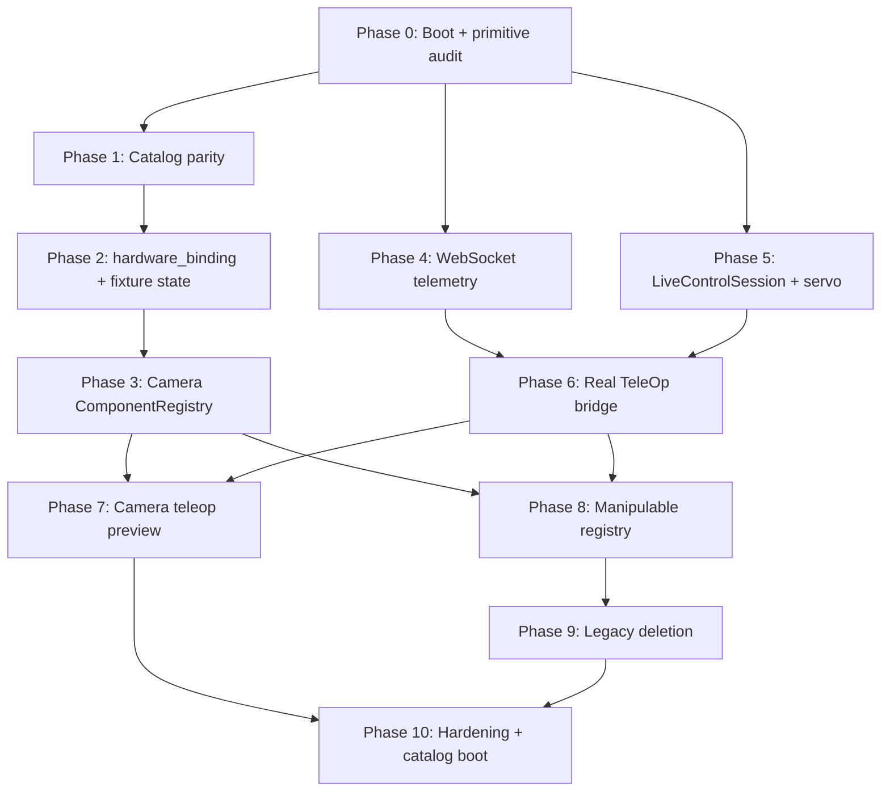

# Real bench roadmap — phases

**Status:** planning  
**Last updated:** 2026-05-22

**Specs this roadmap implements:**

- [REAL_BENCH_FAST_TELEOP_IMPLEMENTATION.md](./REAL_BENCH_FAST_TELEOP_IMPLEMENTATION.md) — TeleOp transport, primitive map, unified components (Part II)
- [LAB_AUTOMATION_AND_TELEOP_ANALYSIS.md](./LAB_AUTOMATION_AND_TELEOP_ANALYSIS.md) — gap analysis, boot bug, legacy inventory
- [CLOUDLAB_CONTRACT.md](../CLOUDLAB_CONTRACT.md) — cross-repo catalog boundary

**Repos:** `optics-digital-twin` (cloud-labs) and `lab_automation` (sibling checkout).

---

## How to read this document

| Column | Meaning |
|--------|---------|
| **Phase** | Ordered milestone — do not skip unless noted |
| **Size** | Rough effort: **S** (days), **M** (1–2 weeks), **L** (multi-week) |
| **Repos** | Which codebase changes land in |
| **Exit** | Objective “done” check — must pass before next phase |
| **Parallel** | Phases that can run concurrently without blocking |

**North star:** Mock and real speak the **same component vocabulary** (`tag_id`, tunables/measurables, primitives) and the **same TeleOp transport** (WebSocket pose push + servo motion + fast camera preview).

---

## Dependency overview

**Recommended first hardware milestone:** end of **Phase 6** (table Rz TeleOp on real arm, tunable commit on END).  
**Recommended first UI milestone:** end of **Phase 4** (mock TeleOp without HTTP poll storm).

---

## Phase 0 — Real boot + primitive audit

| | |
|---|---|
| **Size** | **M** |
| **Repos** | cloud-labs |
| **Depends on** | — |
| **Parallel with** | — (start here on real bench) |

### Goal

Make `RealLabCommunicator` actually initialize: catalog load, `OpticalExperiment`, scan, `component_map`, v1 lab state. Establish a **machine-readable audit** of which primitives reach hardware.

### Work

**cloud-labs**

- [ ] Fix `RealLabCommunicator.__init__` — remove dead code after early `return` in `_load_catalog_for_lab_automation`
- [ ] Ensure scan emits **v1** `lab_state.components[tag_id]` with `statecontrol` split
- [ ] Apply lab frame transforms on scan (`coordinate_frames.py`)
- [ ] Add test or script: for each `PrimitiveId` in `PRIMITIVE_REGISTRY`, assert real handler exists and is callable
- [ ] Document gaps in a generated table (handler → `_primitive_*` → lab_automation method)

**lab_automation**

- [ ] Smoke: `OpticalExperiment(mock=False)` connects robot + cameras without crash
- [ ] Confirm `*_cloudlab` pick/hover/place still run on hardware

### Exit criteria

- [ ] Backend starts in real mode; scan populates manipulable `component_map`
- [ ] `GET /api/lab-state` returns v1-shaped JSON
- [ ] Primitive audit lists every primitive as ✅ / ⚠️ / ❌ with owner file

### Risks

Boot bug masks all downstream real work — **do not start TeleOp on hardware until this passes**.

---

## Phase 1 — Catalog parity and naming

| | |
|---|---|
| **Size** | **M** |
| **Repos** | cloud-labs (JSON bundles) |
| **Depends on** | Phase 0 (know which tags scan discovers) |
| **Parallel with** | Phase 4 (mock WebSocket can use updated mock catalog) |

### Goal

Mock and real **component_library.json** describe the same component language. Table-top camera exists on real. Camera rows stop lying about hardware.

### Work

- [ ] Add **`tag_99`** (`cam_table_top`, `CEILING_CAMERA` or `OPTICAL_CAMERA`) to **real** bundle — copy/adapt from mock
- [ ] Rename misleading rows: `cam_gripper_1/2` → `cam_table_beam_1/2` (or equivalent)
- [ ] Introduce **`properties.hardware_binding`** on every camera row (recorder TCP vs OpenCV USB)
- [ ] Add ceiling inventory tags (`tag_90`, `tag_91`) if scan needs explicit stereo pair — or document “internal only” choice
- [ ] Update **`active_catalog.json`** (real) to include operator-visible camera tags
- [ ] Remove **`nominal_pose`** from fixed camera capabilities where present
- [ ] Run catalog validator / `platform.verify_registries()` — all widgets and primitives resolve

### Exit criteria

- [ ] Real and mock libraries diff only where deployment requires (IPs, paths)
- [ ] Every camera row has `hardware_binding`; no new code relies on `cam_gripper_N` slug hack
- [ ] `tag_99` present in real library and active catalog

---

## Phase 2 — `hardware_binding` resolver + fixture lab state

| | |
|---|---|
| **Size** | **M** |
| **Repos** | cloud-labs |
| **Depends on** | Phase 1 |
| **Parallel with** | Phase 5 (lab_automation servo work) |

### Goal

cloud-labs routes camera/tunable/measurable calls through **one resolver**, not scattered `cam_id` / `stream_source` checks. Fixed components appear in **lab_state at boot**, not only after scan.

### Work

- [ ] Add `resolve_hardware_binding(catalog_row)` in `lab_model/catalog/schema.py`
- [ ] Migrate `resolve_cam_id_for_tag`, `resolve_telemetry_stream_backend`, `camera_image`, `exposure_time_ms`, `real/video.py` to use binding
- [ ] Boot / `initialize_state`: seed **fixture rows** for catalog tags without manipulable presence (cameras, future lasers)
- [ ] Per-tag telemetry routes: `/api/components/{tag_id}/telemetry/stream` for overhead (`tag_99`) and recorder (`tag_22`)
- [ ] Deprecation shim: old `cam_gripper_*` convention logs warning once

### Exit criteria

- [ ] `GET /api/components/tag_99/tunables` works on real after boot (no scan required)
- [ ] `RECORD_MEASURABLES` on `tag_99` and `tag_22` hits correct backend via binding
- [ ] Unit tests for all camera bindings in real + mock bundles

---

## Phase 3 — lab_automation `ComponentRegistry` (cameras first)

| | |
|---|---|
| **Size** | **L** |
| **Repos** | lab_automation (+ thin cloud-labs bridge if needed) |
| **Depends on** | Phase 2 |
| **Parallel with** | Phase 4, Phase 5 |

### Goal

Cameras become **`LabComponent`** instances keyed by `tag_id`. Remove `ceiling_cam1`, `camera_gripper_*` as ad-hoc fields over time.

### Work

**lab_automation**

- [ ] New package `components/`: `base.py` (`LabComponent`, `ComponentRegistry`), `cameras.py` (`RecorderTableCamera`, `OpenCVCamera`)
- [ ] `ComponentFactory.from_catalog(catalog_doc)` builds camera instances from `hardware_binding`
- [ ] `OpticalExperiment.__init__(catalog=...)` optional kwarg — registry replaces direct camera fields for **new** code paths
- [ ] Facade methods: `experiment.registry.get("tag_22").capture_still()`, `.start_stream(profile=...)`
- [ ] Wire existing recorder subprocess + OpenCV drivers through camera components

**cloud-labs**

- [ ] `RealLabCommunicator` passes catalog into experiment construction when Phase 3 API lands
- [ ] `RECORD_MEASURABLES` / `START_LIVE_FEED` call registry on lab side

### Exit criteria

- [ ] No `experiment.ceiling_cam1` in **new** cloud-labs code paths — all via `tag_99`
- [ ] Recorder TCP 1/2 reachable as `tag_22` / `tag_21` (or renamed tags)
- [ ] Mock + real still capture and stream work end-to-end through tag URLs

### Risks

Keep old fields as aliases until Phase 8 — **dual-path is OK** briefly; grep before deleting fields.

---

## Phase 4 — WebSocket TeleOp telemetry (mock + frontend)

| | |
|---|---|
| **Size** | **M** |
| **Repos** | cloud-labs, frontend |
| **Depends on** | Phase 0 (optional for mock-only: none) |
| **Parallel with** | Phases 1–3, 5 |

### Goal

Replace HTTP `GET …/telemetry/live-pose` polling @ ~20 Hz with **server-push** WebSocket. Mock and real share the **same client protocol**.

### Work

**cloud-labs**

- [ ] `WS /api/teleop/session` (or equivalent) — auth by session id from `START_TELEOP`
- [ ] Mock: software pose integrator pushes @ 50 Hz (reuse `TeleopLivePoseStore` logic, not HTTP)
- [ ] HTTP `POST …/goto` remains fallback; WS carries goto when connected

**frontend**

- [ ] New `frontend/js/api/teleop-session-ws.js`
- [ ] `teleop-session.js`: connect on START, disconnect on END
- [ ] `LivePosePoll` widget reads store only — transport-agnostic
- [ ] Client-side goto coalescing (max ~20 Hz)

### Exit criteria

- [ ] Mock TeleOp: smooth CURRENT row + canvas LIVE **without** live-pose HTTP poll in network tab
- [ ] `teleop-live-pose.js` retained as debug fallback only
- [ ] Protocol documented in spec (message shapes for pose + goto)

---

## Phase 5 — lab_automation `LiveControlSession` + xArm servo mode

| | |
|---|---|
| **Size** | **L** |
| **Repos** | lab_automation |
| **Depends on** | Phase 0 |
| **Parallel with** | Phases 1–4 |

### Goal

Introduce the **real-time motion subsystem** TeleOp requires: servo Cartesian mode, command worker, pose publisher — independent of cloud-labs UI.

### Work

- [ ] `drivers/xarm_driver.py`: `set_mode(0)` ↔ `set_mode(1)` lifecycle, stream Cartesian targets, read TCP pose at high rate
- [ ] New `managers/live_control.py`: `LiveControlSession` with command queue + publisher thread + shared pose buffer
- [ ] Table Rz **enter**: approach, grasp, hold (reuse `AssemblyManager` setup — extract, do not rewrite)
- [ ] Table Rz **exit**: open gripper, retract, return to mode 0
- [ ] Bench script: WS-less test — enqueue targets @ 20 Hz, verify no per-frame blocking `wait=True`

### Exit criteria

- [ ] Hardware smoke: session enter → nudge rotation → exit without crash
- [ ] Pose buffer updates ≥ 20 Hz while moving
- [ ] Documented API: `start_table_rotation(tag_id)`, `set_target(pose)`, `stop()`, `read_pose()`

### Open decision (resolve before coding)

Table Rz: **transient lift** during whole session vs **on-table** rotation — affects grasp force and allowed Z. See analysis doc §10.

---

## Phase 6 — Real TeleOp bridge (cloud-labs ↔ lab_automation)

| | |
|---|---|
| **Size** | **M** |
| **Repos** | cloud-labs, lab_automation |
| **Depends on** | Phases 4, 5 |
| **Parallel with** | Phase 3 (partial) |

### Goal

Full **table Rz TeleOp on hardware**: START → WS pose → goto → END with **tunable commit** (already implemented in cloud-labs orchestrator).

### Work

**cloud-labs**

- [ ] `RealLabCommunicator._primitive_prepare_teleop` → lab `LiveControlSession.start_table_rotation`
- [ ] `_on_teleop_motion_idle` / `end()` → lab session stop + `commit_teleop_session_pose`
- [ ] WS goto → lab command queue (same queue as HTTP goto)
- [ ] WS pose source = lab publisher buffer (not `TeleopLivePoseStore` sim on real)

**lab_automation**

- [ ] `experiment_manager` facade methods called from cloud-labs thread pool (`asyncio.to_thread`)

**frontend**

- [ ] No changes if Phase 4 protocol stable

### Exit criteria

- [ ] Operator: START TeleOp on real tagged optic → nudge Rz → END → `nominal_pose.rotation` persisted in lab state
- [ ] Golden rule: measurables nulled on teleop start (unchanged)
- [ ] Holding session consistent with cloud-labs JSON `holding`

**🎯 Major milestone:** first usable real-bench TeleOp session.

---

## Phase 7 — Camera teleop preview profile

| | |
|---|---|
| **Size** | **M** |
| **Repos** | lab_automation, cloud-labs |
| **Depends on** | Phases 3, 6 |
| **Parallel with** | — |

### Goal

During TeleOp, live beam spot on **`tag_22`** (recorder) uses a **fast preview profile** — not the slow `CAP` still path.

### Work

- [ ] Recorder teleop profile config (e.g. scale 0.25, JPEG quality 50) in `recorder_cam_laser_align_cloudlab.py`
- [ ] `START_LIVE_FEED` selects `profile=teleop` when teleop session active
- [ ] `real/video.py`: shorter timeouts, drain stale frames, optional WS JPEG lane
- [ ] UI: MJPEG / JPEGPoll on per-tag telemetry URL (not hard-coded `/api/table-cam/stream`)

### Exit criteria

- [ ] Spot visibly tracks rotation with **< 100 ms perceived lag** during Phase 6 session
- [ ] `RECORD_MEASURABLES` still uses full-quality CAP (slow) — unchanged contract
- [ ] `tag_99` overhead stream available for layout context (optional second panel)

---

## Phase 8 — Manipulable registry migration

| | |
|---|---|
| **Size** | **L** |
| **Repos** | lab_automation, cloud-labs |
| **Depends on** | Phases 3, 6 |
| **Parallel with** | Phase 7 |

### Goal

Table optics (mirrors, lenses, filters) live in **`ManipulableOptic`** subclasses inside `ComponentRegistry`, not a parallel `component_map` dict of legacy `OpticalComponent` objects.

### Work

- [ ] Move `objects/optics.py` → `components/manipulable.py`; inherit `LabComponent`
- [ ] `ComponentRegistry.manipulables()` drives scan, pick, hover, place, optimize
- [ ] **Extract** `ManipulableMotionService` from `AssemblyManager` (move-only refactor first)
- [ ] cloud-labs scan reconciles registry tag_ids with lab_state keys
- [ ] Remove duplicate `component_map` once registry is authoritative

### Exit criteria

- [ ] Full cloudlab primitive smoke test passes: scan → pick → hover → place → optimize
- [ ] TeleOp from Phase 6 still passes
- [ ] No behavior change in placement rules, clearance Z, or holding session semantics

### Risks

Highest regression risk phase — **move logic before renaming**; run hardware smoke after each sub-step.

---

## Phase 9 — lab_automation simplification (legacy deletion)

| | |
|---|---|
| **Size** | **M** |
| **Repos** | lab_automation |
| **Depends on** | Phase 8 |
| **Parallel with** | — |

### Goal

Delete unused legacy code so the repo is **small and cloudlab-specialized**.

### Work

- [ ] Move `scripts/01–04_check_*.py` → `devtools/` (keep for bench bring-up)
- [ ] Delete `original_codes/` after final grep confirms zero imports
- [ ] Delete legacy recorder paths: `service_recorder.py`, `recorder_capture_helpers.py`, `recorder_camera_driver.py`, `camera_recorder_manager.py`, pre-cloudlab runners
- [ ] Trim `experiment_manager.py`: remove non-`*_cloudlab` placement/reconstruction methods
- [ ] Update `SCRIPTS_GUIDE.md` / README to single cloudlab entry points

### Exit criteria

- [ ] `tests/test_cloudlab_primitives_mock.py` + clearance tests green
- [ ] Hardware smoke: scan, pick, place, teleop, capture
- [ ] No imports from deleted modules in cloud-labs or lab_automation

**Rule:** archive to a tag or branch before bulk delete — recovery path for obscure motion edge cases.

---

## Phase 10 — Hardening, catalog boot, extensibility

| | |
|---|---|
| **Size** | **M** |
| **Repos** | both |
| **Depends on** | Phases 7, 9 |
| **Parallel with** | — |

### Goal

Production-ready safety, full **`OpticalExperiment(catalog=...)`** contract, and proof that **new instrument types** (laser) plug in without touching `video.py`.

### Work

- [ ] Session mutex, watchdog, estop handling on TeleOp lease
- [ ] Gripper slip detection policy (document + minimal implementation)
- [ ] `OpticalExperiment(catalog=)` required path — no hardcoded camera USB indices in experiment init
- [ ] **`LaserComponent` stub** + one catalog example row — tunable `output_power_mw`, measurable readback — even if driver mocks
- [ ] CI: primitive coverage test + binding resolver tests + mock TeleOp WS test
- [ ] Retire global routes `/api/video-feed`, `/api/table-cam/*` if per-tag telemetry fully covers UI

### Exit criteria

- [ ] All items in spec §27 acceptance checklist green
- [ ] Adding a laser catalog row + tunable plugin does not require editing camera code
- [ ] Documented runbook for operator TeleOp + failure recovery

---

## Summary table

| Phase | Name | Size | Primary repo | Blocks |
|-------|------|------|--------------|--------|
| **0** | Boot + primitive audit | M | cloud-labs | everything on real |
| **1** | Catalog parity (`tag_99`, bindings) | M | cloud-labs | 2, 3 |
| **2** | Resolver + fixture lab state | M | cloud-labs | 3, 7 |
| **3** | Camera ComponentRegistry | L | lab_automation | 7, 8 |
| **4** | WebSocket telemetry | M | cloud-labs + UI | 6 |
| **5** | LiveControlSession + servo | L | lab_automation | 6 |
| **6** | Real TeleOp bridge | M | both | 7, 8 |
| **7** | Camera teleop preview | M | both | 10 |
| **8** | Manipulable registry | L | lab_automation | 9 |
| **9** | Legacy deletion | M | lab_automation | 10 |
| **10** | Hardening + catalog boot | M | both | — |

---

## Suggested execution order (sprints)

If one developer is on the bench and one on mock/UI, split like this:

| Sprint | Track A (bench) | Track B (mock/UI/catalog) |
|--------|-----------------|---------------------------|
| **1** | Phase 0 | Phase 1 + Phase 4 |
| **2** | Phase 5 | Phase 2 |
| **3** | Phase 6 | Phase 3 (cameras) |
| **4** | Phase 7 + Phase 8 | Phase 8 support + tests |
| **5** | Phase 9 + Phase 10 | Phase 10 CI + laser stub |

---

## What we deliberately defer

| Item | Why later |
|------|-----------|
| **Held pose3d TeleOp** (full x/y/z/rz in air) | Table Rz proves servo + WS pipeline first |
| **Motor-stage TeleOp** (`MOVE_MOTOR` live) | Different backend; catalog gating needed |
| **Gripper alignment cameras as catalog tags** | Optional `tag_92/93`; internal drivers OK short-term |
| **Retire HTTP live-pose entirely** | Keep debug route after Phase 4 |
| **Full laser driver** | Phase 10 stub proves extensibility only |

---

## Links

- Detailed TeleOp + component design: [REAL_BENCH_FAST_TELEOP_IMPLEMENTATION.md](./REAL_BENCH_FAST_TELEOP_IMPLEMENTATION.md)
- Gap analysis and open questions: [LAB_AUTOMATION_AND_TELEOP_ANALYSIS.md](./LAB_AUTOMATION_AND_TELEOP_ANALYSIS.md)
