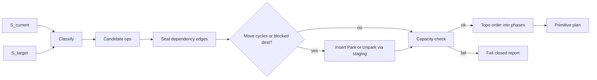

# Reconcile planning: seat DAG + staging (proposal)

**Status:** Proposal / design only — **not implemented**  
**Last updated:** 2026-08-01  
**Audience:** maintainers of Twin VC hard-checkout, diff, and reconcile  
**Related:** [`Onboarding.md`](./Onboarding.md) (hard jump), [`backend/lab_model/coordinator/state/reconcile.py`](../backend/lab_model/coordinator/state/reconcile.py), [`diff.py`](../backend/lab_model/coordinator/state/diff.py)

---

## 1. Why this exists

Today’s hard jump builds a **configuration patch plan**:

1. `configuration_diff(S_current, S_target)` — field-level changes  
2. `plan_reconcile` — each change → a primitive, mostly in sorted tag order  
3. Execute the list on the bench  

That is enough for many edits. It is **not** enough when intermediate seats conflict:

- **A↔B swap** (or longer move cycles): first `MOVE` lands on an occupied seat  
- **Storage peak**: need to `STORE` before `PLACE` frees a slot, but durable storage is full  
- **Move order**: A moves into B’s current seat while B still sits there  

This document proposes replacing the spatial part of planning with a **seat-resource dependency DAG**, plus (later) a **staging buffer** so the Graph Relocation Problem is solvable or fails closed with a clear report.

**Out of scope for the first implementation wave:** wiring staging seats into layouts, shipping DAG planner code, or changing Twin apply UX. This file is the design contract so that work can land in follow-ups without re-litigating the model.

---

## 2. Target architecture (summary)

| Layer | Role |
|-------|------|
| Diff (fields) | Keep today’s tunable / presence diffs for motors, exposure, membership |
| Seat occupation | Map each on-table tag to a discrete **seat** in current vs target |
| Ops + DAG | Spatial ops with “A before B” edges when B needs a seat A frees |
| Staging (later) | Reconcile-only parking seats; never committed into VC nodes |
| Phases | Park → Remove → Move → Add → Unpark → Tune |

---

## 3. Formal model

### 3.1 State and seats

- **S** — versioned table configuration (membership model): breadboard tags with `nominal_pose`, plus durable storage membership outside the active table set.
- **Seat** — discrete resource a part can occupy:
  - `BenchSeat(pose_key)` — quantized pose / footprint cell on the breadboard  
  - `StorageSlot(i,j)` — durable Q3 inventory  
  - `StagingSeat(k)` — **reconcile-only** parking (layout-declared later; forbidden in commits)
- **Occupation** — `tag_id → seat` for a state. Two tags must not share a seat (v1: overlapping footprints count as conflict).

**Invariant:** every committed VC node uses only bench + durable storage — **never** staging. Staging is scratch space for intermediate frames only.

### 3.2 Per-tag classification

Compare occupation in `S_current` vs `S_target`:

| Class | Meaning | Base op |
|-------|---------|---------|
| `remove` | on bench now, absent from target table | `STORE_COMPONENT` |
| `add` | absent from current table, on bench in target | `PLACE_FROM_STORAGE` |
| `move` | on bench both sides, seat changes | `MOVE_COMPONENT` to target seat |
| `stay` | same bench seat | no spatial op (motors/exposure still allowed) |

Non-spatial tunables (`SET_MOTOR_SETPOINT`, `SET_EXPOSURE`) attach after the tag’s spatial settle (or a final Tune wave).

### 3.3 Dependency rule

Emit candidate ops, then add edge `A → B` (“run A before B”) when:

1. **B needs a seat that A frees** (B’s destination is A’s current seat, and A removes/moves/parks away), or  
2. **A would enter a seat B still occupies** until B leaves, or  
3. **Park / Unpark pairing** (park before the move that needed the buffer; unpark after the destination is free), or  
4. **Durable storage capacity** — a STORE that needs a free slot waits on a PLACE in the same plan only when that schedule is chosen; otherwise use staging (later) or **fail closed**.

If the move subgraph has a cycle with no free destination, **break with staging** (once staging exists): park one tag on the cycle → others proceed → unpark to the final seat.

### 3.4 Canonical phases

After cycle-breaking, linearize with fixed phases (DAG edges refine order inside a phase):

1. **Park** — staging parks for cycles / emergency buffer  
2. **Remove** — `STORE_COMPONENT`  
3. **Move** — `MOVE_COMPONENT` to final free bench seats  
4. **Add** — `PLACE_FROM_STORAGE` (+ motor/exposure extras, as today)  
5. **Unpark** — staging → final seats  
6. **Tune** — remaining non-spatial setpoints  

This matches the operator intuition “remove, then move what stays, then add,” with parks only when the seat graph requires them.

### 3.5 Fail closed (capacity / impossibility)

Before execute, compute peak demand and legality:

- Durable storage free slots vs peak STOREs before PLACEs  
- Staging seats vs parks required to break cycles (when staging exists)  
- Illegal **target** (two tags same seat / overlapping footprints in `S_target`)  
- Add without the part available in durable storage / inventory  

Return a structured report (extend checkout compatibility): e.g. `blocking`, `needs_staging_n`, `cycle_tags`, `peak_storage` — not a silent bad plan.

### 3.6 Explicit non-goals (v1 planner)

- Continuous path / arm-sweep collision  
- Multi-gripper parallelism  
- Using `HOLDING` as the general buffer (single gripper)  
- Committing staging occupations into VC nodes  

---

## 4. Mapping onto the codebase (when implemented)

| Piece | Today | Proposed |
|-------|-------|----------|
| Diff | [`diff.py`](../backend/lab_model/coordinator/state/diff.py) `configuration_diff` | Keep for fields; add seat occupation layer |
| Plan | [`reconcile.py`](../backend/lab_model/coordinator/state/reconcile.py) `plan_reconcile` | Replace **spatial** emission with DAG planner |
| Execute | Twin reconcile runner / [`reconcile_executor.py`](../backend/lab_model/coordinator/state/reconcile_executor.py) | Same primitives; staging moves later |
| Compatibility | [`checkout_compatibility.py`](../backend/lab_model/coordinator/state/checkout_compatibility.py) | Cycle / capacity / staging issues |
| Layout | bench layout JSON | Later: `reconcile_staging_seats` |
| Config extract | [`projections.py`](../backend/lab_model/coordinator/state/projections.py) | Refuse/strip staging from commits; doctor flags |

Touched concerns stay in **VC + reconcile + diffs** (and eventually layout staging metadata). No change to edge RECORD/SYNC ownership or Twin FSM commit rules beyond plan generation.

---

## 5. Worked examples

| Scenario | Without staging DAG | With DAG + staging |
|----------|---------------------|--------------------|
| A↔B pose swap | Two MOVEs; first hits occupied seat | Park A → Move B → Unpark A |
| Remove B from P, place A at P | Works if STORE before PLACE | Store B → Place A (no staging) |
| Storage full, remove 1 / add 1 | STORE may fail | Need ≥1 staging or durable free, else block with report |
| Cycle A→B→C→A | Undefined / collision | One park breaks cycle; topo order completes |

---

## 6. Implementation checklist (follow-ups — not this PR)

1. **Seat layer** — occupation from `nominal_pose` (+ optional footprint), unit tests for swap/cycle detection.  
2. **DAG planner module** — e.g. `reconcile_dag.py`; `plan_reconcile` delegates spatial ops; keep field extras.  
3. **Phases + topo** — Park/Remove/Move/Add/Unpark/Tune; deterministic tie-break (tag id).  
4. **Compatibility report** — surface `cycle_tags`, `peak_storage`, `needs_staging_n`.  
5. **Staging seats (separate, higher risk)** — layout schema, mock/real layout entries, commit invariant, doctor; only after DAG tests are green.  
6. **Twin** — plan preview shows parks; apply unchanged aside from richer plan JSON.  
7. **Docs** — trim the “honest caveat” in Onboarding once behavior ships.

Until (5) lands, the DAG can still **detect** impossible intermediates and fail closed even if it cannot yet auto-park.

---

## 7. Decision record

- **Staging default:** dedicated staging seats (not durable Q3 inventory cells), so STORE/PLACE inventory semantics stay clean.  
- **Scope of this proposal:** documentation only.  
- **Graph Relocation / physical staging area:** deferred; expect a larger change with more bug surface — do not block documenting the DAG model on shipping staging hardware layout.
